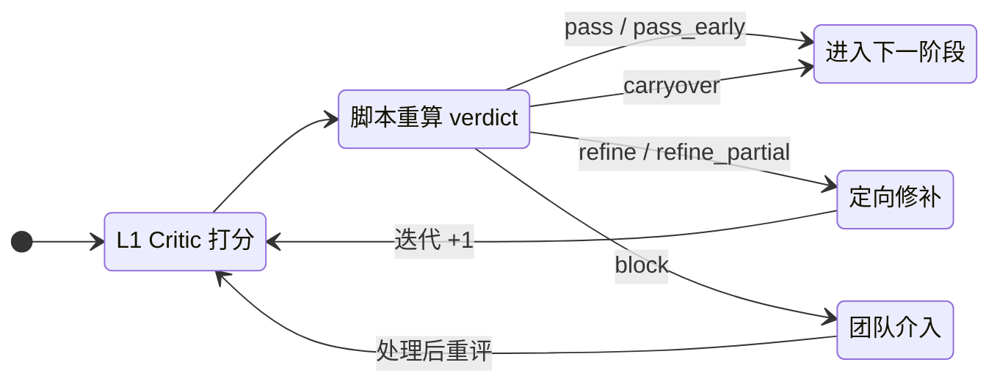
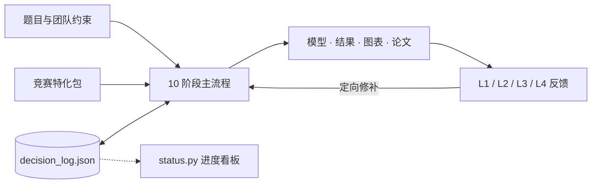
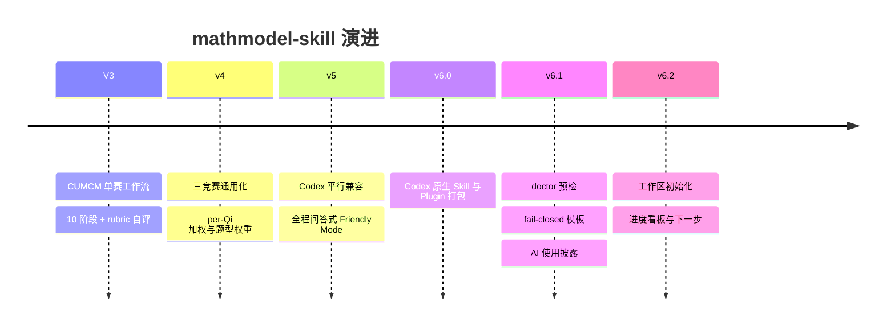

<div align="center">



<h3>把 72–96 小时的数学建模竞赛，变成一条可恢复、可检查、可交付的 Agent 工作流</h3>

<p>
  <a href="./.codex-plugin/plugin.json"></a>
  <a href="https://github.com/handsomeZR-netizen/mathmodel-skill/actions/workflows/ci.yml"></a>
  <a href="https://github.com/handsomeZR-netizen/mathmodel-skill/stargazers"></a>
  <a href="https://github.com/handsomeZR-netizen/mathmodel-skill/commits"></a>
  <a href="./LICENSE"></a>
</p>
<p>
  <a href="./competitions/"></a>
  <a href="#-快速开始"></a>
  <a href="./scripts/doctor.py"></a>
</p>

<p>
  <a href="#-快速开始"><b>快速开始</b></a> ·
  <a href="#-为什么是-mathmodel-skill"><b>核心亮点</b></a> ·
  <a href="#-30-秒看懂"><b>30 秒看懂</b></a> ·
  <a href="#-工作流全景"><b>工作流</b></a> ·
  <a href="#-竞赛支持"><b>竞赛支持</b></a> ·
  <a href="#-常见问题"><b>常见问题</b></a> ·
  <a href="#-star-history"><b>Star History</b></a>
</p>

</div>

---

数学建模比赛很少因为“缺少一个更聪明的回答”而失败。更常见的是：**模型换了，摘要没改；第二问重算了，第三问还在引用旧结果；关键假设只活在聊天记录里；直到提交前，才发现匿名、页数或 AI 披露不合规。**

mathmodel-skill 不是一个试图一口气生成整篇论文的 Prompt，也不是替团队做决定的黑盒 Agent。它是一套**可执行的建模工作流**：把选题、拆题、模型选择、求解、稳健性分析、论文装配和终审组织成 10 个阶段，用一份共享决策日志保存整个项目的状态。团队只回答关键的编号问题，Agent 负责维护状态、调用脚本、整理产物。

> [!TIP]
> **一句话上手**：安装后在 Codex 里输入 `使用 $mathmodel-skill，开始 CUMCM 建模。`，或在 Claude Code 里说 `开始建模`。之后随时说 **“看进度”**，就能看到当前阶段、评分、合规门和下一步。

## ✨ 为什么是 mathmodel-skill

<table>
<tr>
<td width="33%" valign="top">

**🧭 10 阶段，一条主线**

选题 → 拆题 → 选型 → 求解 → 稳健性 → 写作 → 终审。每个阶段都有进入条件、退出条件和回退路径，Agent 在可检查的位置停下来，而不是一口气跑到底。

</td>
<td width="33%" valign="top">

**🧠 一份状态，随时接力**

`state/decision_log.json` 记录每个决定、依据、评分与回退。换队员、换对话、从 Codex 换到 Claude Code，都从同一个检查点继续，不靠聊天记忆。

</td>
<td width="33%" valign="top">

**⚖️ 脚本裁决，不靠自评**

Critic 打分之后，由 `score_artifact.py` 重新计算 verdict。任何关键维度低于门槛都会单独暴露，不会被加权均分“平均掉”。

</td>
</tr>
<tr>
<td width="33%" valign="top">

**🎯 哪里错，只修哪里**

Stage 5 按子问保存状态：`refine_partial` 只返工没通过的 Qi，其余结果保持不动；论文按 section patch 定向修补，不推倒重来。

</td>
<td width="33%" valign="top">

**🛡️ 提交前 fail-closed**

占位符、缺失章节、模板 marker 错位会直接失败；当届规则、匿名、页数、AI 披露、支撑材料五道终审门不过，就不能标记 `submission_ready`。

</td>
<td width="33%" valign="top">

**📊 一眼看进度** <sup>`v6.2 新`</sup>

`status.py` 汇总 10 个阶段的 verdict、子问状态、合规门和截止倒计时，按剩余时间给出模式建议，并只给出**一条**明确的下一步。

</td>
</tr>
</table>

### 它专门对付这些“翻车现场”

| 😵 比赛中的常见情况 | ✅ mathmodel-skill 的处理方式 |
| --- | --- |
| 对话越来越长，早期决定难以追溯 | 所有阶段共用 `state/decision_log.json`，统一保存选择、依据、评分与回退记录 |
| 总体表现尚可，但某个关键维度明显不足 | Verdict 同时检查最低分和加权均分；高严重度问题不能被平均数掩盖 |
| 只有 Q2 需要返工，却牵连全部结果 | Stage 5 按 Qi 保存状态，`refine_partial` 只修改受影响的子问 |
| 三类竞赛要求不同，维护成本不断增加 | 一条主流程 + competition pack、权重 overlay 和模板表达差异 |
| Markdown 章节写好了，主 TeX 却没引用到 | 模板使用显式 section marker；缺失、重复或未知 marker 直接失败 |
| 封面或摘要仍含占位符，却被当成正式稿 | 正式渲染 fail-closed；占位符只能用于显式 dry-run |
| 临近提交才发现页数、匿名或 AI 披露问题 | Stage 0、8、9 重新打开规则入口；合规门不过不能进入 `submission_ready` |
| Pandoc、TeX 或依赖问题直到最后才暴露 | `doctor.py` 一次性检查结构、竞赛包、Python、Pandoc、TeX 与可选依赖 |
| 忙了一整天，说不清现在到底卡在哪 | `status.py` 只读汇总进度、阻断项与下一步，不改动任何状态 |

## 🎬 30 秒看懂

**① 开口说一句** —— Agent 只询问还缺的启动信息（竞赛、题号、队伍、截止时间、题面），然后用 `init_workspace.py` 建好工作区。

**② 关键决策点，只需回答数字** —— 没有原生选择 UI 的环境会退化为编号列表，语义完全一致：

```text
【Stage 3 · Q1 用哪个候选模型？】

  1) 混合整数规划 (MILP) — 目标与约束线性，求解器可给出最优性证明
  2) 遗传算法 — 适合非凸、高维离散搜索
  3) 禁忌搜索 — 中等规模组合优化，易实现
  4) 让我决定（推荐 1：Stage 2 已标记目标为线性）

回复数字即可。
```

**③ 任何时候说“看进度”** —— 下面是 `status.py` 对一份示例状态的真实输出：Stage 5 中只有 Q2 没过，所以下一步只精修 Q2。

<div align="center">

<br><sub>示例数据，仅用于展示看板格式</sub>
</div>

## 🧭 工作流全景

<div align="center">

</div>

<br>

| Stage | 任务 | 关键产物 | 主要检查 |
| ----: | --- | --- | --- |
| 0 | 团队启动与资料预扫 | 竞赛、角色、时限、环境、规则基线 | 可执行性与合规入口 |
| 1 | 多题比较与选题 | 选择理由、放弃项、题型判断 | 资源匹配与失败风险 |
| 2 | 问题拆解 | 子问、变量、约束、依赖图 | 逻辑完整性 |
| 3 | 模型选型 | 候选模型、证据、反事实与淘汰理由 | 模型与问题的匹配程度 |
| 4 | Foundation | 假设、符号、术语表 | 一致性与可解释性 |
| 5 | 递归求解 Q1…Qn | formulation、代码、结果、图表 | per-Qi 评分与定向回修 |
| 6 | 稳健性分析 | 风险匹配的验证、稳健区间、失败边界 | 灵敏度与结论可靠性 |
| 7 | 模型评价 | 优点、局限、改进、迁移条件 | 边界是否诚实、结论能否推广 |
| 8 | 论文装配 | `paper_workspace/*.md`、TeX/PDF、AI 台账 | 跨阶段一致性与格式合规 |
| 9 | 提交前终审 | 最终 PDF、支持材料、Panel 记录 | 合规门、证据链与视觉检查 |

### 每一轮评审如何收敛

评分工具输出的是**流程状态**，而不是奖项预测。Critic 给分之后，verdict 一律由脚本重新计算：



| Verdict | 触发条件 | 行为 |
| --- | --- | --- |
| `block` | 存在至少 1 个高严重度问题 | 暂停流程，由团队介入 |
| `pass_early` | 最低分 ≥ 9 且加权均分 ≥ 9 | 首轮即可提前通过 |
| `pass` | 最低分 ≥ 7 且加权均分 ≥ 8 | 进入下一阶段 |
| `pass_with_review` <sub>Stage 5</sub> | 个别 Qi 需复核，但加权阈值满足 | 进入 Stage 6，L2 必读复核项 |
| `refine` | 其他情况 | section patch 精修，最多 3 轮 |
| `refine_partial` <sub>Stage 5</sub> | 部分 Qi 最低分 < 7，其余已通过 | 只精修这些 Qi |
| `carryover` | 达到迭代上限仍需精修 | 进入下一阶段，遗留问题交给 L2 回检 |

### 三种反馈模式

同一条主流程，只调整反馈预算和评审深度：

| Mode | 反馈层 | 适用场景 |
| --- | --- | --- |
| `fast` | L1 单轮 | 选题试跑、快速 sanity check、时间紧张时的关键阶段 |
| `standard` | L1 + L2 | 默认比赛流程 |
| `championship` | L1 + L2 + L3 + L4 + red-team | 终稿前的深度评审 |

`status.py` 会按剩余时间给出建议（< 6h 直接进 Stage 9 终审；6–24h 关键阶段用 `fast`；其余用 `standard`），但**切换模式始终需要团队确认**。

## 🏆 竞赛支持

| 竞赛包 | 语言与模板 | 当前材料 | 可信度说明 |
| --- | --- | --- | --- |
| **🇨🇳 CUMCM 国赛** | 中文；XeLaTeX / 原创 `ctexart` 电子论文模板 | 91 份公开论文来源，其中 59 份成功提取文本进入统计；42 项维护者反模式检查 | 材料最完整；观察分位不是官方门槛，规则以当届通知为准 |
| **🌍 MCM/ICM 美赛** | English；pdfLaTeX / `article` | 16 项维护者检查；已记录 COMAP 2027 页数、字号与 AI 披露基线 | 经验层 `n=0`，不提供论文分位；提交前必须重新核对 COMAP 要求 |
| **⚡ 电工杯** | 中文；XeLaTeX / `ctexart` | 12 项工程导向检查；已记录官网页序、25 页正文、支撑材料与匿名基线 | 经验层 `n=0`；当前官网未提供专门 AI 格式，仍需检查当届通知 |

<details>
<summary><b>截至 2026-07-22 已核对的官方规则入口</b></summary>

- [CUMCM 2026 竞赛规则](https://www.mcm.edu.cn/html_cn/node/9d8e511fe7a1447b35f53a82c908e2e0.html)
- [CUMCM 2026 论文格式规范](https://www.mcm.edu.cn/html_cn/node/4cd596519c9eb9fbd866398f6df0caa3.html)
- [COMAP 2027 Instructions](https://www.contest.comap.com/undergraduate/contests/mcm/instructions.php)
- [电工杯参赛规则](https://shumo.neepu.edu.cn/jszz/csgz.htm)
- [电工杯论文规范](https://shumo.neepu.edu.cn/jszz/lwgf.htm)

这些链接构成仓库当前的规则基线，但不能替代参赛当年的官方文件。

</details>

## 🚀 快速开始

### 1. 安装

**Codex（macOS / Linux）**

```bash
git clone https://github.com/handsomeZR-netizen/mathmodel-skill.git \
  ~/.agents/skills/mathmodel-skill

python ~/.agents/skills/mathmodel-skill/scripts/doctor.py --competition cumcm

mkdir -p my-modeling-project && cd my-modeling-project
codex
```

<details>
<summary><b>Codex（Windows PowerShell）</b></summary>

```powershell
git clone https://github.com/handsomeZR-netizen/mathmodel-skill.git `
  "$HOME\.agents\skills\mathmodel-skill"

python "$HOME\.agents\skills\mathmodel-skill\scripts\doctor.py" `
  --competition cumcm

New-Item -ItemType Directory -Force my-modeling-project | Out-Null
Set-Location my-modeling-project
codex
```

</details>

<details>
<summary><b>只安装到当前项目（项目级 skill）</b></summary>

```bash
mkdir -p .agents/skills
git clone https://github.com/handsomeZR-netizen/mathmodel-skill.git \
  .agents/skills/mathmodel-skill
```

</details>

**Claude Code**

```bash
git clone https://github.com/handsomeZR-netizen/mathmodel-skill.git \
  ~/.claude/skills/mathmodel-skill

mkdir -p my-modeling-project && cd my-modeling-project
claude
```

### 2. 开口说一句

| 环境 | 输入 |
| --- | --- |
| Codex | `使用 $mathmodel-skill，开始 CUMCM 建模。` |
| Claude Code | `开始建模`，或 `使用 mathmodel-skill 开始 MCM 建模` |

首次启动时，Agent 只询问还缺的竞赛、题号、队伍能力、截止时间和题面位置，然后初始化工作区并进入 Stage 0；工作区已有状态时，则从最近的检查点继续。

### 3. 之后只需要回答问题

Agent 会在需要判断的节点停下来问你；状态写入、文件组织和脚本调用都由它完成。任何时候都可以说：

`看进度` · `进入 stage N` · `回退到 stage M` · `做 L2 回检` · `升级到 championship` · `切到 mcm`

> [!NOTE]
> 想先手动体验看板？两条命令即可（`init_workspace.py` 只创建、不覆盖已有状态）：
>
> ```bash
> python ~/.agents/skills/mathmodel-skill/scripts/init_workspace.py \
>   --competition cumcm --workspace . --problem 未公布 --hours-left 72
> python ~/.agents/skills/mathmodel-skill/scripts/status.py --workspace .
> ```

<details>
<summary><b>可选：完整数值环境与论文编译</b></summary>

核心工作流和 `doctor.py --skip-tools` 不依赖完整的科学计算栈。只有需要运行仓库中的建模起步代码时，才需要安装额外依赖：

```bash
python -m pip install -r \
  ~/.agents/skills/mathmodel-skill/templates/shared/requirements.txt
```

正式进行论文转换与编译时，还需要安装 [Pandoc](https://pandoc.org/installing.html) 和 TeX Live 或 MiKTeX：CUMCM 与电工杯使用 XeLaTeX，MCM/ICM 使用 pdfLaTeX。内置简化转换器仅用于 `--no-compile` 结构预检，不应作为正式论文的编译方式。

</details>

## 📦 工作区产物

```text
my-modeling-project/              # 由 init_workspace.py 创建
├── state/
│   └── decision_log.json         # 决策、评分、回退、规则与 AI 使用台账
├── results/                      # 结构化结果与可复现实验输出
├── figures/                      # 最终图表
├── paper_workspace/              # 01_abstract.md … 10_appendix.md，以及按需披露片段
├── paper_output/                 # TeX 中间文件与最终 PDF
└── support_materials/            # 代码、数据清单与竞赛要求的披露材料
```

Codex 与 Claude Code 可以在同一目录中接力。`decision_log.json` 负责保存流程状态，但不会自动同步工作区之外的文件。

## 🧰 工具箱

模型负责需要判断的工作，脚本负责可以确定的工作，团队保留最终决定权。

| 工具 | 用途 | 典型调用 |
| --- | --- | --- |
| `scripts/init_workspace.py` <sup>新</sup> | 创建工作区与初始状态；已有状态时只报告恢复点，从不覆盖 | `python <skill>/scripts/init_workspace.py --competition mcm --problem C --hours-left 96` |
| `scripts/status.py` <sup>新</sup> | 只读进度看板：阶段 verdict、per-Qi、合规门、倒计时、模式建议与下一步 | `python <skill>/scripts/status.py --workspace . --markdown` |
| `scripts/doctor.py` | 检查 skill 结构、竞赛包、环境与工作区 | `python <skill>/scripts/doctor.py --competition mcm` |
| `scripts/score_artifact.py` | 校验 critic JSON、重算加权分数与 verdict、聚合 per-Qi | `python <skill>/scripts/score_artifact.py --stage 5 --critique ...` |
| `scripts/extract_diff.py` | 生成并应用 section-level patch | `python <skill>/scripts/extract_diff.py --apply ...` |
| `scripts/render_paper.py` | 将 Markdown 工作区装配为三类竞赛的 TeX/PDF | `python <skill>/scripts/render_paper.py --competition cumcm --workspace paper_workspace` |
| `scripts/render_ai_usage.py` | 根据台账生成 CUMCM/MCM AI 使用披露材料 | `python <skill>/scripts/render_ai_usage.py --competition mcm ...` |
| `scripts/ingest_papers.py` | 供维护者离线更新经验统计 | 见 [`scripts/README.md`](./scripts/README.md) |

完整 CLI 参数与依赖边界见 [`scripts/README.md`](./scripts/README.md)。

## 🧠 设计原则



系统由三部分组成：**主流程**定义阶段顺序、进入/退出条件和回退路径；**共享决策日志**是项目的连续记忆；**确定性工具**承担评分重算、模板装配、环境诊断、差分应用、AI 披露生成和合规检查。

<details>
<summary><b>工作流优先于超长 Prompt</b></summary>

更长的 Prompt 可以增加背景信息，却不能天然维护状态、依赖与回退路径。这里仍然使用模型完成各阶段任务，但“项目现在在哪里”“上一阶段决定了什么”“什么条件下可以继续”由工作流显式维护。上下文可以变化，项目结构不需要随之消失。

</details>

<details>
<summary><b>检索提供证据，不管理流程</b></summary>

RAG 很适合寻找竞赛规则、领域论文、真实数据和方法依据，但它并不负责决定下一阶段，也不会自动判断新结果是否推翻旧假设。因此，仓库内材料采用版本可控、按阶段加载的竞赛包；外部检索负责提供证据，主流程负责组织行动。

</details>

<details>
<summary><b>Multi-Agent 只用于适合并行比较的环节</b></summary>

多个 Agent 在选题比较、模型攻击和终稿评审中很有价值，但如果每一步都依赖多方协商，协调成本和符号漂移会迅速增加。主流程始终围绕一份共享日志推进；终稿 Panel 可以并行执行，也可以在单 Agent 环境中顺序降级。

</details>

<details>
<summary><b>自动化停在可以检查的位置</b></summary>

`fast` 和 `standard` 模式都可以由一个 Agent 完成，但每个阶段仍然留下明确产物，关键选择仍然需要确认，评分仍然由脚本重算，问题仍然可以按 section 或 Qi 局部修补。团队可以随时查看进度、接管项目、切换模型，或回到某个具体决定，而不必从头重做。

</details>

<details>
<summary><b>更多小而重要的设计</b></summary>

- **只加载当前阶段需要的材料**：根目录 `SKILL.md` 只承担调度职责，阶段细则、rubric、竞赛规则和模板按需加载。
- **一条流程服务三类竞赛**：差异被限制在 `competitions/<comp>/`、题型与阶段权重、LaTeX 模板、提交与披露规则。
- **最低分不会被均分覆盖**：题型权重被限制在 `[0.7, 1.5]`，避免局部偏好过度放大。
- **经验数据只作为参照**：CUMCM 分位描述的是公开样本中的观察位置，不是官方评分线；MCM/ICM 与电工杯的经验层明确记录为 `n=0`。
- **规则记录日期，但不假装永久有效**：`current_rules.md` 保存最近核对日期和官方入口，Stage 0、8、9 仍要求重新查看当届通知。
- **AI 使用从过程开始记录**：台账记录工具、版本、阶段、用途、采用内容和人工复核；`null` 永远不等于“未使用”。
- **看板只读**：`status.py` 从不修改状态；模式建议只是建议，切换需要团队确认并写入 events。
- **能自动验证的内容不依赖“记得检查”**：YAML/JSON、竞赛包、反模式计数、评分边界、模板 marker、渲染 dry-run、工作区初始化与看板均有自动测试覆盖。

</details>

## ❓ 常见问题

<details>
<summary><b>它会替我们写完整篇论文吗？</b></summary>

不会一口气生成。它按阶段推进、在关键节点让团队决策，并把论文拆成可单独修补的章节。公式、代码、数据、事实、引用和最终署名仍由团队负责。

</details>

<details>
<summary><b>能保证获奖，或者预测我们能拿几等奖吗？</b></summary>

不能。`pass`、`refine` 等 verdict 描述的是流程状态，不是奖项预测；CUMCM 经验分位只是公开样本中的观察位置，不是官方评分线。

</details>

<details>
<summary><b>队友用 Codex，我用 Claude Code，能一起用吗？</b></summary>

可以接力。两个环境读写同一份 `state/decision_log.json` 和相同的 schema。共享来自项目目录而不是云同步，所以请用 git 或网盘同步整个工作区。

</details>

<details>
<summary><b>没装 LaTeX / Pandoc 能用吗？</b></summary>

可以。核心工作流、`init_workspace.py`、`status.py` 和 `doctor.py --skip-tools` 都不依赖它们；只有正式编译 PDF 时才需要。`render_paper.py --no-compile` 可以先做结构预检。

</details>

<details>
<summary><b>比赛规则每年都在变，怎么办？</b></summary>

`competitions/<comp>/current_rules.md` 记录核对日期和官方入口，Stage 0、8、9 会要求重新核对当届通知。仓库保存的只是基线，**官方文件永远优先**。

</details>

<details>
<summary><b>比赛中用了 AI，要怎么披露？</b></summary>

从第一天开始记录 AI 使用台账。`render_ai_usage.py` 会为 CUMCM 生成支撑材料 PDF 或正文声明，为 MCM 生成接入主模板的 AI 使用报告。台账为 `null` 时会被视为“尚未核对”，而不是“未使用”。

</details>

<details>
<summary><b>离截止只剩几个小时了，还有用吗？</b></summary>

有。说“看进度”，`status.py` 会按剩余时间给出建议：不足 6 小时建议直接进入 Stage 9 的 championship 终审，优先保证合规门。是否切换由团队决定。

</details>

<details>
<summary><b>普通数据分析、课程论文能用它吗？</b></summary>

不建议。触发边界刻意限定在 CUMCM、MCM/ICM 和电工杯的竞赛工作；通用的模型选择或非竞赛写作不会、也不应该触发它。

</details>

## 📜 版本演进



### v6.2 · 看得见的进度

- 新增 `scripts/init_workspace.py`：按 Stage 0 已知答案一次性创建 `state/`、`results/`、`figures/`、`paper_workspace/`、`paper_output/`、`support_materials/` 与初始状态。它只创建、不覆盖：已有状态时只报告恢复点，竞赛不一致或文件损坏时明确失败。
- 新增 `scripts/status.py`：只读汇总 10 个阶段的最新 verdict 与分数、Stage 5 子问状态、规则基线 / AI 台账 / 五道终审门、截止倒计时和模式建议，并给出唯一的下一步；支持终端、Markdown 与 JSON 输出。
- “开始建模”和“看进度”改为调用上述脚本，Codex 与 Claude Code 得到同样的结果；`doctor.py` 与 CI 同步覆盖新脚本。
- README 全面改版：动态横幅、10 阶段流程图、看板示例、verdict 状态机、FAQ 与自动更新的 Star History。

<details>
<summary><b>v6.1 · 可靠性与合规</b></summary>

- 新增 `doctor.py`，统一检查包结构、竞赛包、反模式计数、模板 marker 和工具链状态。
- 三类竞赛生成的 section 会自动接入 `main.tex`；缺失章节、空章节、未知 marker 或重复 marker 都会明确失败，正式编译不会静默降级。
- CUMCM 改用仓库原创、MIT 授权的 `ctexart` 电子论文模板；模板不包含身份字段，并对摘要页、正文页数和最终提交元数据执行 fail-closed 检查。
- 评分器改为由脚本重新计算 verdict，同时校验 stage、iteration、最低分、均分和题型权重。
- `extract_diff.py --apply` 不再要求与应用差分无关的 critique 输入。
- 新增 AI 使用台账与披露生成器：CUMCM 根据“已使用 / 明确未使用”生成支撑材料 PDF 或正文声明；MCM 报告自动进入主模板。
- 补充电工杯官网规则基线，将封面、摘要起始页码、无目录、正文与附录顺序纳入模板和终审门。
- 修复分类交叉验证中的标准化泄漏、优化示例中的不可行贪心基线、熵权法常数列、GM(1,1) 极限和 MAPE 零值边界。
- 将 CUMCM 样本口径校准为“91 份来源、59 份可提取文本”；Stage 9 按当前竞赛动态加载反模式清单。

</details>

## 🔒 边界与可信度

> [!IMPORTANT]
> mathmodel-skill 是协作与质量控制工具，**不是自动获奖系统**。它不会消除建模本身的不确定性，也不能替代团队对公式、代码、数据、事实、引用和最终署名的责任。

- CUMCM 统计来自公开样本中成功提取文本的 59 份论文，可能受到年份、题型、来源和 PDF 可提取性的影响。
- `winning_patterns.md`、经验分位和反模式清单属于维护者总结，不是官方 rubric。
- MCM/ICM 与电工杯的经验统计目前均为 `n=0`，相关写作模式只能作为启发，不能解释为实测获奖规律。
- 竞赛规则会变化。仓库保存的是最近一次核对的基线，正式提交前必须以当届官方通知和题目要求为准。
- AI 生成的公式、代码、事实和引用必须由团队复核。台账和披露生成器帮助完整记录，但不代替合规判断。

## 🧪 开发与验证

```bash
python -m compileall -q scripts templates/shared/code_starter
python -m unittest discover -s tests -p 'test_*.py' -v
python scripts/doctor.py --competition cumcm --skip-tools
python scripts/doctor.py --competition mcm --skip-tools
python scripts/doctor.py --competition diangong --skip-tools
git diff --check
```

当工作流、模板或竞赛包发生变化时，请同步更新测试、版本号和规则核对日期。

<details>
<summary><b>仓库结构</b></summary>

```text
SKILL.md                         # 工作流主入口与调度协议
agents/openai.yaml               # Codex UI 元数据
.codex-plugin/plugin.json        # Codex Plugin manifest
skills/mathmodel-skill/SKILL.md  # Plugin 发现 shim
AGENTS.md                        # 仓库维护约定
assets/                          # README 使用的原创 SVG 图示
competitions/
  cumcm/                         # 规则、59 份样本统计、写作启发、评分覆盖与模板骨架
  mcm/                           # COMAP 规则基线；经验统计 n=0
  diangong/                      # 官网规则基线；经验统计 n=0
references/
  stage_00_* ... stage_09_*      # 按阶段加载的执行细则
  feedback_layer1_* ... layer4_* # 阶段评分、回检、Panel 与校准
  model_catalog.md               # 模型候选目录
templates/
  latex/{cumcm,mcm,diangong}/    # 三类竞赛 LaTeX 模板
  shared/                        # 状态、AI 台账、表格与 Python 起步代码
config/dim_weights.json          # 竞赛 × 题型 × 阶段的评分权重
scripts/                         # 初始化、看板、环境检查、评分、差分、装配、披露与维护工具
tests/                           # 回归测试与 fixture
```

</details>

## ⭐ Star History

<div align="center">
<a href="https://star-history.com/#handsomezr-netizen/mathmodel-skill&Date">
  <picture>
    <source media="(prefers-color-scheme: dark)" srcset="https://api.star-history.com/svg?repos=handsomezr-netizen/mathmodel-skill&type=Date&theme=dark">
    <source media="(prefers-color-scheme: light)" srcset="https://api.star-history.com/svg?repos=handsomezr-netizen/mathmodel-skill&type=Date">
    
  </picture>
</a>
<br>
<sub>图表由 <a href="https://star-history.com">star-history.com</a> 实时生成，随 Star 数自动更新，并跟随 GitHub 的深色 / 浅色主题。</sub>
</div>

## 🤝 参与贡献

参与贡献前请先阅读 [`AGENTS.md`](./AGENTS.md)。Bug、规则更新与改进建议都可以通过 [Issue](https://github.com/handsomeZR-netizen/mathmodel-skill/issues) 提交；如果你核对过新一届的官方规则，也非常欢迎直接提 PR 更新 `competitions/<comp>/current_rules.md`。

## 📄 License

仓库原创代码、文档、README 图示以及三类竞赛装配模板采用 [MIT License](./LICENSE)。运行时依赖和外部资料链接仍遵循各自的许可条款，详细边界见 [`THIRD_PARTY_NOTICES.md`](./THIRD_PARTY_NOTICES.md)。

---

<div align="center">

**mathmodel-skill 不替团队完成思考。**<br>
它让每一次判断都留下依据，让每一次修改都知道影响范围，也让一场漫长的建模协作最终能够被完整地交付。

<sub>如果它对你的队伍有帮助，欢迎点一个 ⭐ Star，让更多参赛同学看到它。</sub>

<a href="#top">⬆ 回到顶部</a>

</div>
